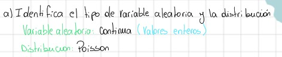

```{r setup, include=FALSE}
knitr::opts_chunk$set(echo = TRUE)
library(ggplot2)

```

#### 1. En una fábrica de teléfonos, tres teléfonos son seleccionados aleatoriamente por trabajadores para evaluar su calidad. Cada teléfono es categorizado como “aceptable” o “defectuoso” según los resultados de su evaluación. Si la probabilidad de que un teléfono sea aceptable es del 0.75 y las evaluaciones son independientes:
##### a) Identifica el tipo de variable aleatoria y la distribución que sigue:

Se identifica la variable aleatoria y distribución como;

{withd=80%}

##### b)Determina la función de probabilidad de masa.

Definimos la probabilidad de masa escrita a mano;

{height=35%}
\newpage 
Definimos los datos para corroborar el calculo realizado:
```{r}

# Parametros de la distribución binomial
n = 3  # número de ensayos
p = 0.75  # probabilidad de éxito

#calculamos para cada valor
k_valores = 0:n
valores = dbinom(k_valores, size=n, prob=p)

print(paste("Funcion de probabilidad de masa, resultado:",valores))

# Creando un data.frame con los resultados
datos = data.frame(k_valores, valores)

print(datos)

```

\newpage
c)Grafica la distribución.

Graficamos la funcion: 


Usamos R para graficar y corroborar resultado:
```{r}
# Creando la gráfica

grafico = ggplot(data=datos, aes(x=as.factor(k_valores), y=valores))
grafico = grafico + geom_col(fill="lightblue")
grafico = grafico + labs(title="Distribución Binomial de Teléfonos Aceptables",
                         x="Número de Teléfonos Aceptables",
                         y="Probabilidad")
grafico = grafico + theme_minimal()
grafico = grafico + geom_text(aes(label=sprintf("%.3f", valores)), vjust=-0.5)
grafico = grafico + ylim(0, max(valores) + 0.1)

# Mostrando el gráfico
print(grafico)

```

#### 2. En un estudio clínico, los voluntarios son examinados para encontrar un gen asociado a la aparición de cáncer. La probabilidad de que una persona tenga el gen es del 0.15. Si se asume que la evaluación de una persona es independiente de otra:

##### a)(0.5 puntos) Señala el tipo de variable aleatoria y la distribución que sigue.

señalamos el tipo de variable aleatoria y distribucion:

*Variable aleatoria*: Discreta

*Distribución*: Binomial negativa


\newpage

b)¿Cuál es la probabilidad de que seis o más evaluaciones deban ser efectuadas para detectar a tres personas portadoras del gen?

{height=35%}
```{r}
# Cálculo usando dnbinom
p = 0.15  # Probabilidad de éxito
r = 3     # Número de éxitos deseados
Prob6 = 1 - pnbinom(q=2, size=r, prob=p)

print(paste("La probabilidad es de:",Prob6))


```


##### c)¿Cuál es el número esperado de evaluaciones que debes realizar para detectar tres personas portadoras del gen?

\newpage

{height=35%}
```{r}
#Calculamos la esperanza.
Esperanza = r/p

print(paste("La cantidad de casos necesarios para encontrar 3 personas serían:", Esperanza))


```

d)Grafica la distribución.

*Grafico de la distribución:*

{height=35%}

Realizamos el graico en R:

```{r}

evaluaciones = seq(0,30)
distribucion = dnbinom(x = evaluaciones , size = r , prob = p)

datos = data.frame(evaluaciones,distribucion)

# Crear el gráfico
grafico = ggplot(data=datos, aes(x=evaluaciones, y=distribucion))
grafico = grafico + geom_bar(stat="identity", fill="lightblue3")
grafico = grafico + theme_bw() + ggtitle("Distribución de probabilidades")
grafico = grafico + xlab("Número de Evaluaciones") + ylab("Probabilidad")
grafico = grafico + geom_vline(xintercept=20, linetype="dotted", color="black", linewidth=1.5)

print(grafico)

```

\newpage
#### 3. En una tienda en línea, el 30 % de los clientes realiza una compra después de ver un producto en oferta. Supongamos que observamos a 100 clientes que visitan la tienda en línea.


a)¿Cuál es la probabilidad de que exactamente 25 de estos 100 clientes realicen una compra
después de ver un producto en oferta?

Realizando el calculo:


Comprobando con R los resultados:
```{r}
N2 = 100
P2 = 0.30
K2 = 25

Prob = dbinom(K2, size = N2 , prob = P2)

print(paste("La probabilidad de que exactamente 25 de 100 clientes realicen una compra es:"
            , Prob))
```

\newpage
b)¿Cuál es la probabilidad de que más de 40 clientes realicen una compra después de ver un producto en oferta?


Comprobando con R las respuestas:
```{r}
K3 = 40

P_menor40 = 0
for (i in 0:K3) {
  P_menor40 = P_menor40 + dbinom(i, size = N2,prob = P2)
}
p_final = 1- P_menor40

print(paste("La probabilidad de que compren despúes de ver un producto es de:",p_final))

```
\newpage
c)¿Cuál es el número esperado de clientes que realizarán una compra después de ver un producto en oferta entre los 100 observados?


Comprobando con R las respuestas:

```{r}

N_esperado = N2 * P2

print(paste("El número esperado de clientes es de: ",N_esperado))


```

d)Grafica la distribución:

{height=35%}

Usamos R para graficar:

```{r}

# Cargar librería
library(ggplot2)

# Definir parametros
n=100  # Numero total de ensayos (clientes)
p=0.30 # Probabilidad de exito (realizar una compra)

# Crear una secuencia de posibles éxitos
clientes=seq(0, n)

# Calcular las probabilidades binomiales
probabilidades=dbinom(x = clientes, size = n, prob = p)

# Crear un dataframe con los datos
datos=data.frame(clientes, probabilidades)

# Crear el gráfico
grafico=ggplot(data = datos, aes(x = clientes, y = probabilidades))
grafico=grafico + geom_bar(stat = "identity", fill = "lightblue3")
grafico=grafico + theme_bw() + ggtitle("Distribución Binomial de Compras en Oferta")
grafico=grafico + xlab("Número de Clientes que Compran") + ylab("Probabilidad")

# Mostrar el grafico
print(grafico)


```

##### 4. Una empresa contrata a 600 hombres menores de 50 años. Supongamos que el 25 % tiene un marcador en el cromosoma masculino que indica un mayor riesgo de cáncer de próstata.

a)Indica el tipo de variable aleatoria y la distribución que sigue.


*Variable aleatoria*: discreta
*Distribucion*: hipergeométrica.


b)Si a 15 hombres de la empresa se les hace la prueba del marcador en este cromosoma, ¿cuál es la probabilidad de que exactamente 2 hombres tengan el marcador?


Realizamos el calculo en R para corroborar los resultados:


```{r}
N = 600
K = 150
n = 15
k = 2

Prob2 = dhyper(k, K, N-K, n)

print(paste(Prob2))
```

c)Si a 15 hombres de la empresa se les hace la prueba del marcador en este cromosoma,¿cuál es la probabilidad de que más de 2 tengan el marcador?


Realizamos el calculo en R para corroborar los resultados:
```{r}
ProbMenos2 = sum(dhyper(0:k, K, N-K, n))
ProbMas2 = 1 - ProbMenos2

print(paste(ProbMas2))
```
d)Grafica la distribución.


```{r}
Hombres = seq(0, n)
probHombres = dhyper(Hombres, K, N-K, n)

datosHombres = data.frame(Hombres, probHombres)

grafico = ggplot(data = datosHombres, aes(x = Hombres, y = probHombres))
grafico = grafico + geom_bar(stat = "identity", fill = "lightblue3")
grafico = grafico + xlab("Numero de hombres con el marcador") + ylab("Probabilidad")

print(grafico)
```

\newpage
##### 5. El número de llamadas telefónicas que llegan a una central telefónica se modela como una variable aleatoria de Poisson. Supongamos que en promedio hay 6 llamadas por hora.

a)Identifica el tipo de variable aleatoria y la distribución que sigue.

*Variable aleatoria*: Discreta (Ya que se trabaja con la variable que es enteros.)

*Distribucion*: poisson.



b)¿Cuál es la probabilidad de que haya exactamente tres llamadas en una hora?

La probabilidad de que haya exactamente tres:


Usando R para corroborar las respuestas:
```{r}

#Usando poisson para calcular.

T = 1 #Tiempo
lambda = 6 #Llamadas por hora
x = 3  

#Calculamos usando poisson
Calc_poisson = (exp(-lambda * T) * (lambda * T)^x )/factorial(x)

paste(Calc_poisson)


```

\newpage
c)¿Cuál es la probabilidad de que haya cinco llamadas o menos en una hora?

{height=45%}

Usando R para corroborar las respuestas:

```{r}

Y = 5
P_total = 0

for (i in 0:Y) {
  P_total = P_total + ((exp(-lambda * T) * (lambda * T)^i )/factorial(i))
  
}

print(paste("La probabilidad de que haya cinco llamadas o menos en una hora es de: ", P_total))
```
